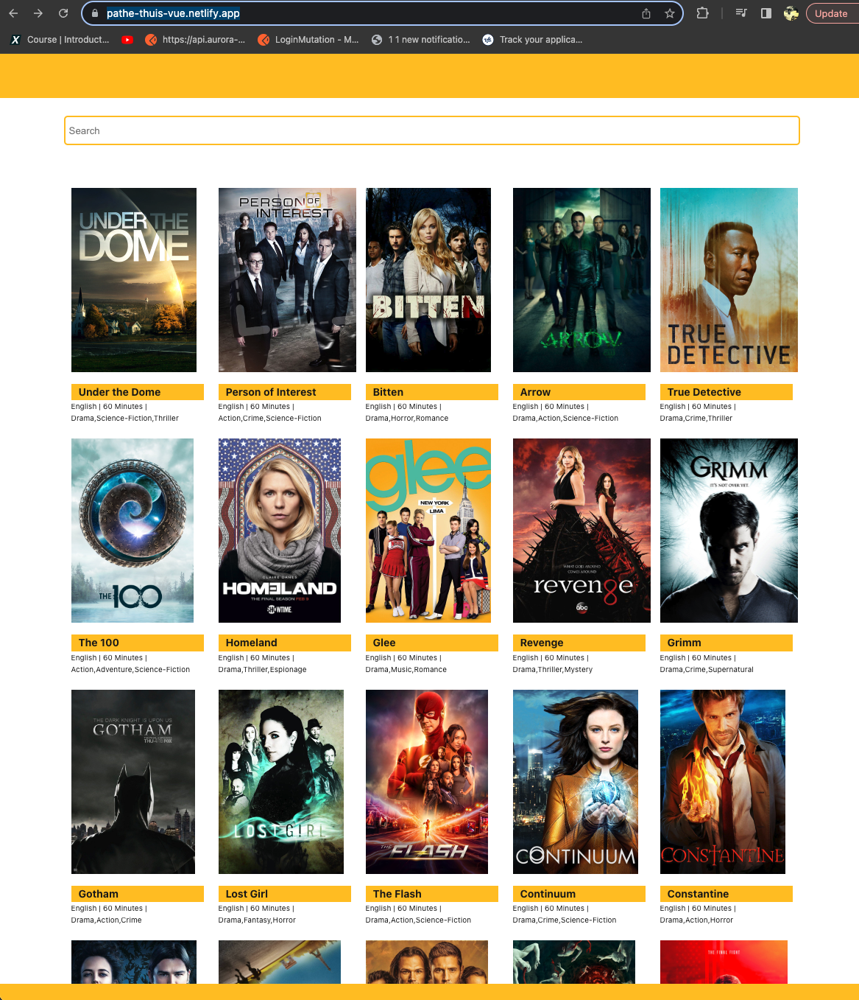
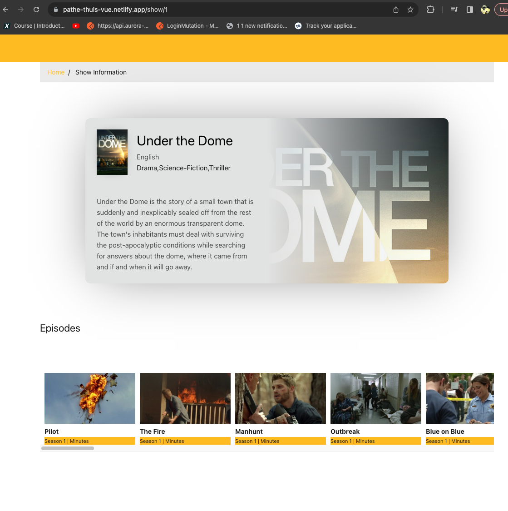
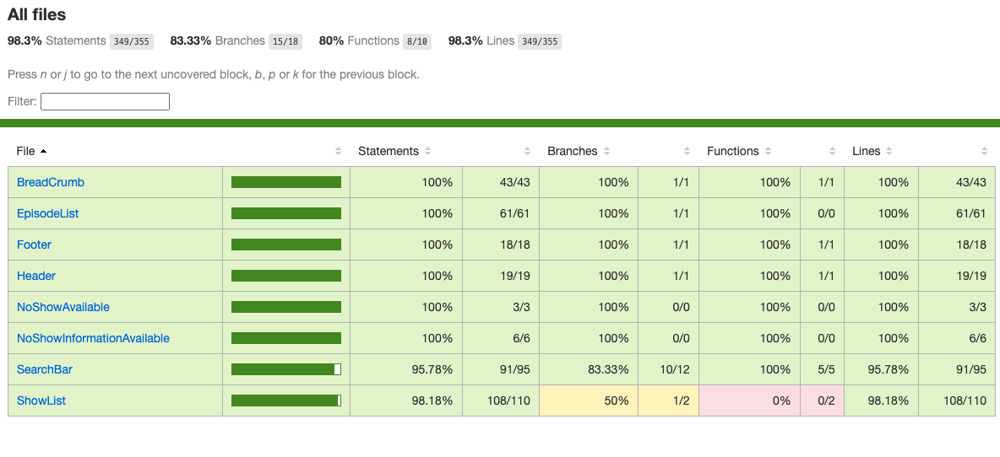

# pathe-thuis

A Vuejs Project to consume api from TVMAZE (http://www.tvmaze.com/api), show the list of shows available. Allow the user to search for their favorite show. User can also find additional information about the show such as Genre, Language, Runtime and Summary. Episode information about the show along with Season and duration of each episode.

# Application URL ( Deployed Application)
https://pathe-thuis-vue.netlify.app/


## Application Design
The Application has two views, Home page and Show View. 
In Home Page View , user can see the list of all available shows from the external api. User can scroll through the list of all shows. Or with the help of search bar, user can search for their favorite show. The search bar supports Auto Complete Option, which allows the user to do search quicker and efficient.
The Home page view provides information about the show such as Name , Language, Duration and Genere.



When user has found a show which they would like to know more, then by simply clicking on the show thumbnail.This will take the user to the Show Information page, where user can find information about the show in detail. Information such as Summary of the show, And Episodes available are presented to the user.



## Project Setup

```sh
npm install
```

### Compile and Hot-Reload for Development

```sh
npm run dev
```

### Type-Check, Compile and Minify for Production

```sh
npm run build
```

### Run Unit Tests with [Vitest](https://vitest.dev/)

```sh
npm run test:unit
```
### RunUnit Test Coverage.
```sh
npm run coverage
```



### Lint with [ESLint](https://eslint.org/)

```sh
npm run lint
```


